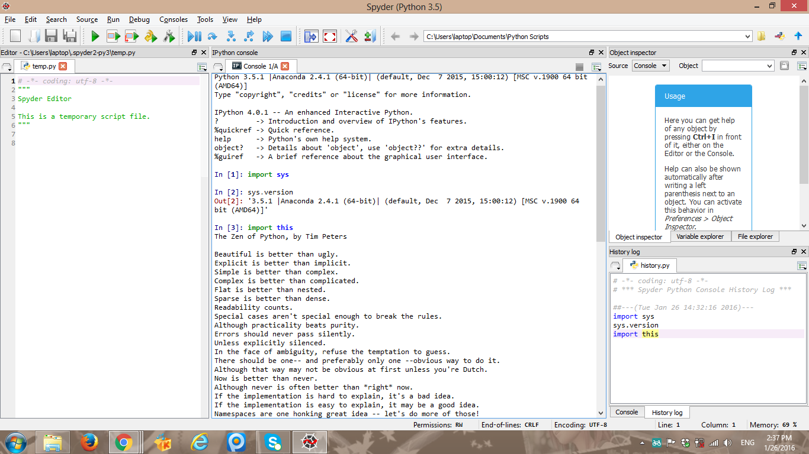

UECM3033 Assignment #1 Report
========================================================

- Prepared by: ** Tham Kien Yang**
- Tutorial Group: T3

--------------------------------------------------------

## Task 1 -- setup a github repository

The reports, codes and supporting documents are uploaded to Github at: 

[https://github.com/ThamKienYang/UECM3033_assign1](https://github.com/your_github_id/UECM3033_assign1)

---------------------------------------------------------

## Task 2 -- setup python

Put here the screen shot of file (python.png)

------------------------------------------------------------

## Task 3 -- modify and run Python script

In this section, please report:

1. The hexadecimal value of my student ID is 0xa66662.

2. The definite integrals that I have chosen is

$$\int_0^{\infty} \frac{1}{{\sqrt{\x}}*{x+1}} dx = \pi.$$

3. My system of 10 linear equations is

\begin{align*}
x_0 + x_1 + x_3 + x_4 &= 1820,\\
x_4 + x_5 + x_6 + x_7 - x_8 &= 0,\\
-2/3 x_0 + x_4 &= 0,\\
-3/4 x_1 + x_5 &= 0,\\
-1/3 x_2 + x_6 &= 0,\\
-4/5 x_3 + x_7 &= 0,\\
- x_4 + 3 x_5 &= 0,\\
- x_6 + 235/136 x_7 &= 0,\\
- x_0 - x_1 + 1/25 x_2 + 1/25 x_3 &= 0,\\
x_9 &= 100.
\end{align*}

-----------------------------------

last modified: 27th December 2016
